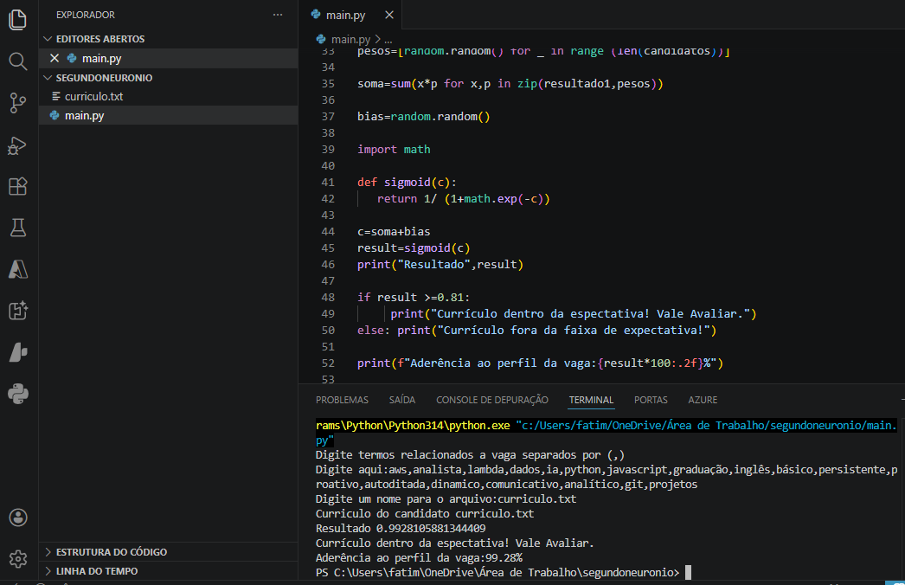

<h1>Neuronio:Avaliador Inteligente de Currículos em Python</h1>

Este projeto implementa um neurônio artificial (Perceptron) do zero em Python, sem o uso de bibliotecas de Machine Learning.
O sistema avalia a aderência de um currículo (.txt) a uma vaga específica com base em termos técnicos definidos pelo recrutador.
OBJETIVO: Aprender lógica de redes neurais;  Avançar aprendizado em python;

Funcionalidades:
Entrada de Dados ( Área para recrutador entrar com termos relacionados a vaga desejada);
Tratamento de texto;
Arquitetura de Rede Neural ( calculos de bias e pesos e ativação da função sigmoid);
Exibição do resultado dos calculos em forma de porcentagem;

<h2>Como Usar</h2>
Prepare um arquivo .txt com o conteúdo do currículo.

Execute o script: python nome_do_arquivo.py

Insira os termos da vaga separados por vírgula.

O sistema retornará a porcentagem de aderência e se o candidato é recomendado para avaliação.

